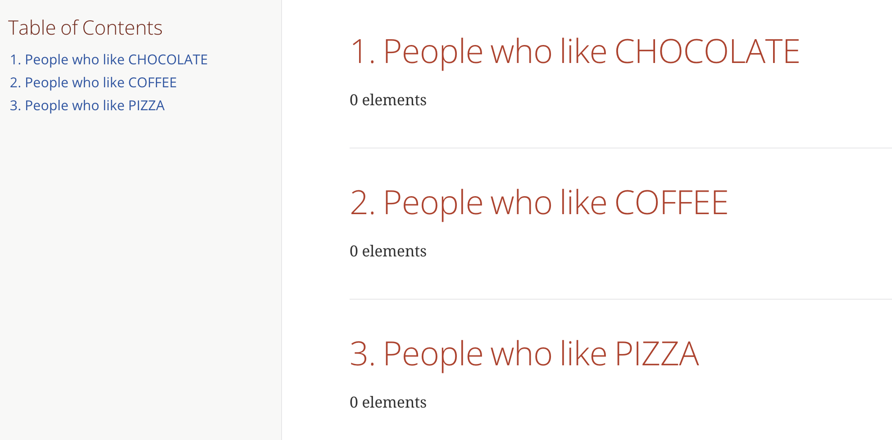

= REDLOG User Guide

== Introduction

RedLog is a `Spring Boot starter` designed to load a templated card, execute its contents, and write the resulting report items to a sink.

Developers write logs as part of the observability to trace operations or capture errors raised by their applications. When issues arise, they query these logs to gain insight into the root causes. RedLog aims to assist by capturing common issues and sharing them with the team, reducing the need to query the logs repeatedly.

[IMPORTANT]
.Disclaimer
====
Currently, the logs source is `Grafana Loki`, and queries are `LogQL`. There are plans to extend support to other sources. The sink for the report result is MongoDB, serving as an example of how data can be stored.
====

== How It Works

Developers or team members query the logs on a dashboard to extract information pointing to potential issues. Once a useful query is identified, it is added to a templated card, which extracts that information and reports it to the team.

=== Card Template Example

Card Templates allow users to interact with the generated report by organizing the sections that highlight the issues which we want to see in our document.

These sections, by and large, are made of type, id, description and query, and they might have other custom properties based in the type.

Each template is composed of various sections, each of a specific type. And currently, there are two section types available: COUNT and SUMMARY.

==== Card Type COUNT

The COUNT section type is used to track the frequency of specific events over time, based on query parameters.

As an example:

Count section
[source,yaml]
----
queries:
  - id: null_pointer_exception
    description: Null Pointer Exception
    type: COUNT
    query: |
        {app="my-app", service="my-service", level="ERROR"}
        |~ `java.lang.NullPointerException`
----

NOTE: The above example is a simple way to indicate the application is generating `NullPointerException` errors.

As customized field for this type, we have the field:

`expectedAtLeast` : This is a filter to collect just those items whose `count` value is greater than or equal to the provided value.

So we can extend the previous example as:

[source,yaml]
----
queries:
  - id: db_connection_problems
    description: DB Connection Issues
    type: COUNT
    expectedAtLeast: 3
    query: |
        {app="my-app", service="my-service", level="ERROR"}
        |~ `Timeout Exception`
----

NOTE: only shows the item if the number the connection issues is 3 or more times.

==== Card Type SUMMARY

The SUMMARY section type provides a snapshot of the service's state over a specific time period.

[source,yaml]
----
queries:
- id: my-report-id
  description: My Report Id
  type: SUMMARY
  query: |
    sum by (host) ( count_over_time(
       {app="my-app", service="my-service", level="ERROR"}
       | json | line_format '{{.message}}' [5m]
    ))
----

In this example we are querying in a range of time, having slots of 5 minutes, and we are counting issues by host as they go.

=== CARD Template Parameterized

Reports can be triggered for the current date or another date for which logs are available. The execution populates a MongoDB collection with extracted items. Users can then request reports to see how their application behaved based on team observations, without needing to gather individual queries.

These templates can be parameterized to be reused for the same application name with different variables applicable to labels, time range or any other.

As an example:

[source,yaml]
----
common_query: '{app="my-app", host="<host>"}'
parameters: ['host']
range: 24h

queries:
- id: my-report-id
  description: My Report Id
  type: SUMMARY
  query: |
    sum by (host) ( count_over_time(
       <common_query>
       | json | line_format '{{.message}}' [<range>]
    ))

----

So, in the previous template, request to generate reports requires `host` param to be replaced in `<host>`, and a default configured `range` has been declared to be used in our query. This leads us to execute our template to observe particular hosts.

As an example, if `host` takes value `localhost`, the executed query in runtime will be like:

[source,text]
----
sum by (host) ( count_over_time(
       {app="my-app", host="localhost"}
       | json | line_format '{{.message}}' [24h]
))
----

== Configuration

=== Dependency

To include this starter in a Spring application, add the following dependency to your `pom.xml`:

[source,xml]
----
<dependency>
    <groupId>com.github.fmcejudo.redlogs</groupId>
    <artifactId>red-log</artifactId>
    <version>0.0.7</version>
</dependency>
----

=== Properties

RedLog offers several properties for customization:

[%header,cols="2,3,2"]
|===
| Property | Description | Default Value

| `redlog.source-type` | Define where to find templated cards. Valid options are `FILE` or `GITHUB`. | `FILE`
| `redlog.file.files-path` | Path where files are located (absolute path with `file:/` or `classpath:`). | No predefined path
| `redlog.github.url-mapper` | Path for each templated card. |
| `redlog.github.github-token` | Token to connect to GitHub. |
| `redlog.loki.url` | URL where `Grafana Loki` is located. | `http://localhost:3100`
| `redlog.loki.username` | Username for connecting to `Grafana Loki`. |
| `redlog.loki.password` | Password for connecting to `Grafana Loki`. |
| `redlog.loki.dashboard-url` | URL to a `Grafana` dashboard showing the executed query. | `http://localhost:3000`
| `redlog.loki.datasource-name` | Datasource name configured in Grafana. | `default`
| `redlog.mongo.collection-name-prefix` | Prefix for MongoDB collection names. | Empty prefix
| `redlog.card.controller-path` | Context path for the `Card` controller. | `card-runner` (resulting in `/card-runner/**` endpoints)
| `redlog.report.controller-path` | Context path for the `Report` controller. | `report` (resulting in `/report/**` endpoints)
| `redlog.execution.controller-path` | Context path for the `Execution` controller. | `report` (resulting in `/execution/**` endpoints)
|===

=== Configuration Examples

==== File-Based Configuration

[source,properties]
----
redlog.source-type=FILE
redlog.file.files-path=cards/
redlog.mongo.collection-name-prefix=redlog
redlog.loki.url=http://localhost:3101
redlog.loki.dashboardUrl=http://localhost:3000
redlog.loki.datasourceName=redlog-datasource
----

==== GitHub-Based Configuration

[source,properties]
----
redlog.source-type=GITHUB
redlog.github.github-token=${GITHUB_TOKEN}
redlog.github.url-mapper.MY_APP=https://github.com/<username>/<repo>/<route_in_repo>
redlog.mongo.collection-name-prefix=sample
redlog.loki.url=http://localhost:3101
redlog.loki.dashboardUrl=http://localhost:9090
redlog.loki.datasourceName=default
----

== Generating Report Document

The starter provides an endpoint to trigger templates based on an application name, this is the `card` controller, and it
receives as parameters those used in our defined template

[source,shell]
----
http :8080/card-runner/<file_name> host=localhost
----

As a result of the task executed in our plugin, it will populate two collections in the previously configured mongo
database: `Executions` and `Reports`

- In `Executions` data defines the application name, parameters and date for which the reports are executed. With a `execution-id` which is pointing to in the `Reports` collection.

- In `Report` collection we can find estate of our execution for each defined entry in our template, with the reference
to `execution-id` to track what information was used to get this information.

== Execution Information

Another controller provided is `execution` in which we can find the list of executions by application name. To list the
execution we generated for the application we can use:

[source,text]
----
http :8080/execution/list/<file>
----

This will resolve the stored executions of our application, showing the parameters and date for which that occurred, and
also a couple of links which will point to the report entries details of such execution.

[source,json]
----
[
  {
    "application": "<FILE>",
    "executionId": "d6dcccf8-e551-4561-bf64-afd8c9c83589",
    "parameters": {},
    "reportDate": "date",
    "links": [
        {
        "rel": "json",
        "href": "http://localhost:8080/report/execution/d6dcccf8-e551-4561-bf64-afd8c9c83589/json"
        },
        {
        "rel": "doc",
        "href": "http://localhost:8080/report/execution/d6dcccf8-e551-4561-bf64-afd8c9c83589/doc"
        }
    ]
  }
]
----

== Report Controller

Finally `report` controller is used to obtain the details of the execution, listing the report entries information gather
in the identified execution.

Thanks to `hateoas` we provide the links to these endpoints built from the execution, what make it easy to navigate to
without composing yourself.

[source,json]
----
{
    "applicationName": "<FILE>",
    "reportDate": "date",
    "params": {
       "host" : "localhost"
    },
    "sections": [
      {
        "executionId": "d6dcccf8-e551-4561-bf64-afd8c9c83589",
        "reportId": "report-id",
        "description": "Report Id",
        "link": "http://link.to.loki",
        "items": [
            ...
        ]
      }
    ]
}
----

== Document Structure

To pretty print information to be readable for users, we implemented a way to generate an `AsciiDoctor` document from
the report items.

The link to read such document is the `rel = doc` in the list of links shown in `execution`.

The generated document is a custom document implemented by the team using the `AsciiDoctorContent` interface.

=== AsciiDoctorContent Interface

[source,java]
----
@FunctionalInterface
public interface AsciiDoctorContent {
    String content(final Report report);
}
----

=== Report Model

[source,java]
----
public record Report(String applicationName, LocalDate reportDate,
                     Map<String,String> params, List<ReportSection> sections) {
}
----

=== ReportSection Model

[source,java]
----
public record ReportSection(String id, String executionId, String reportId, String description, String link,
                            List<ReportItem> items) {
}
----

=== Custom AsciiDoctor Content Example

[source,java]
----
class CustomAsciiDoctorContent implements AsciiDoctorContent {

    @Override
    public String content(final Report report) {
        return ContainerComponent.create()
                .addComponent(DocumentTitle.level(2).withText(report.applicationName().toUpperCase()))
                .addComponent(generateSection(report))
                .content();
    }

    private AsciiComponent generateSection(final Report report) {

        // your section implementation
        return sectionContainer;
    }
}
----

And document with it looks like:

== Storing Reports in MongoDB

Currently, the only storage option for gathering report items is MongoDB, which uses two collections:
1. *executions* – stores information about report executions.
2. *reports* – linked to the corresponding executions.

To manage the size of these collections and avoid keeping unnecessary reports, each document includes a `createdAt` field. This field is used to automatically expire and remove old reports after a set period of time.

=== Applying TTL Index for Expiration

If you want to enable automatic expiration of old records, you can use the provided MongoDB script to apply a TTL (Time to Live) index on the `createdAt` field.

The script is located in the repository at:
link:https://github.com/fmcejudo/redlog/blob/main/db/mongo/redlog-mongo.js[db/mongo/redlog-mongo.js]
